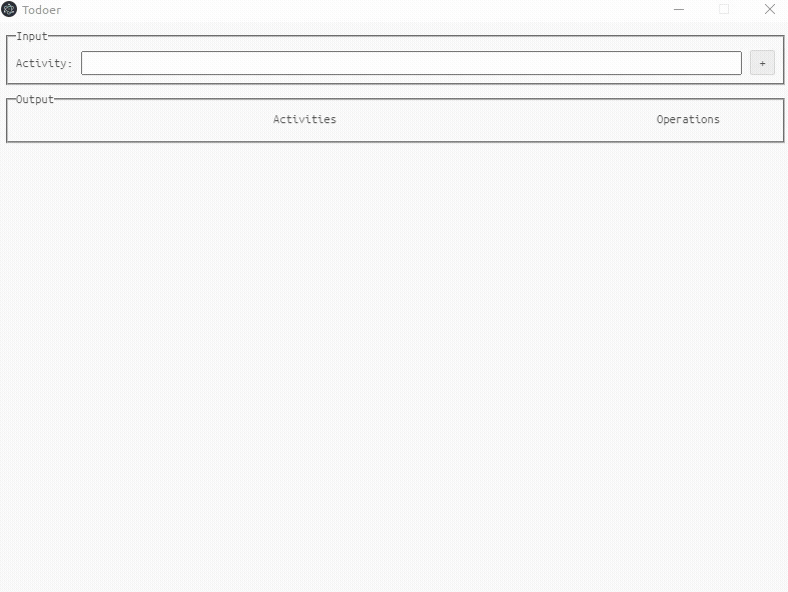

# js-todoer-client

A simple todo app.



> Showcases:
>   - graphql
>   - react

## Usage

```bash
npm i  # install dependencies
npm start  # run app for dev: requires js-todoer-server to be running
```
